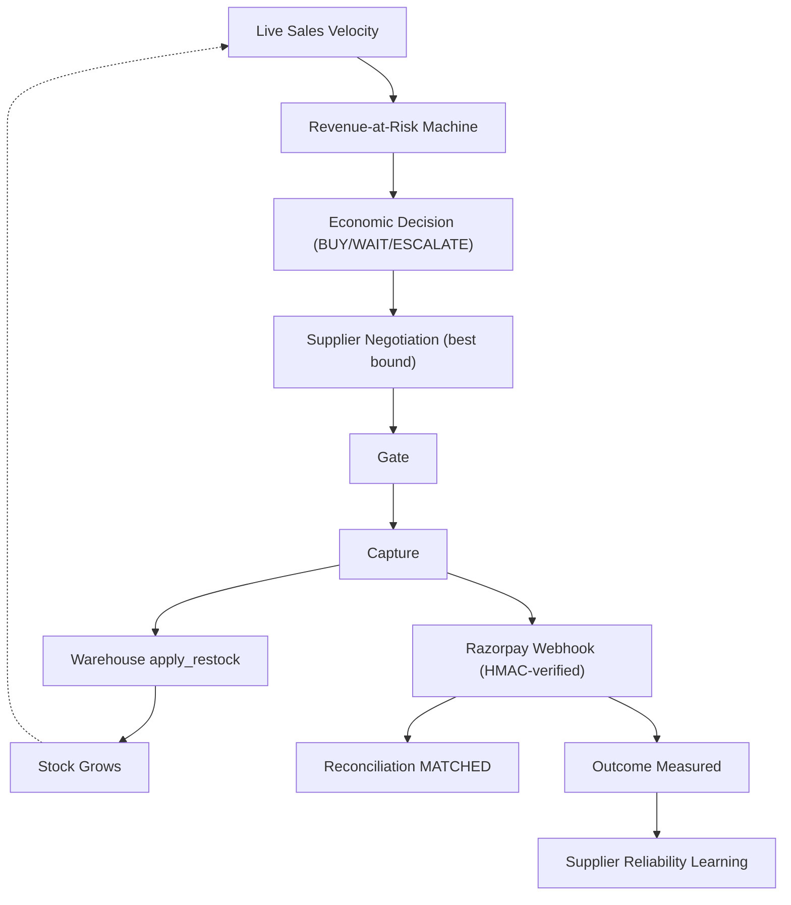
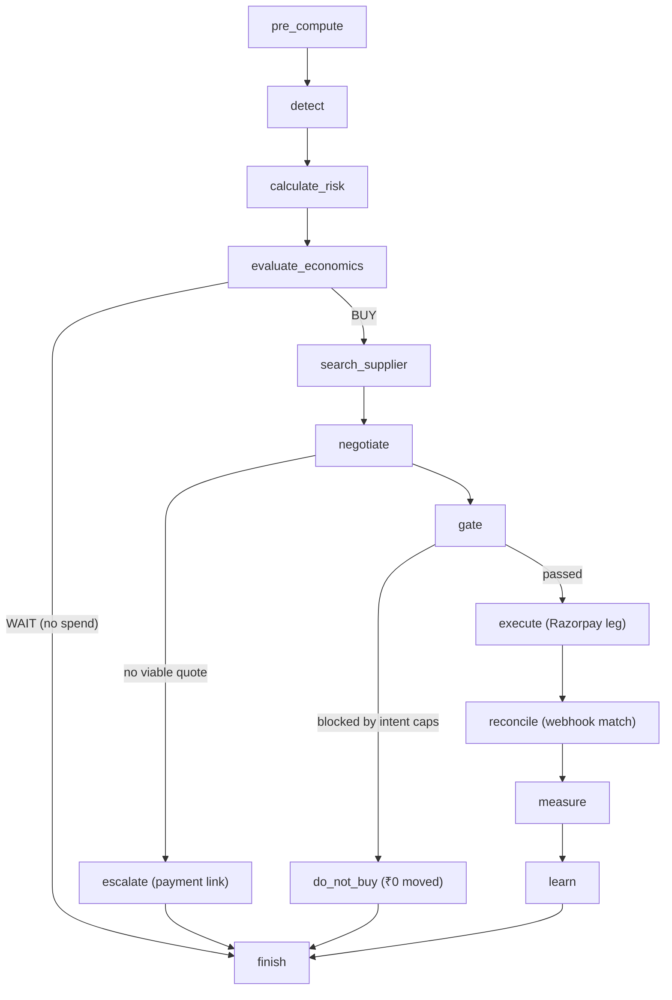
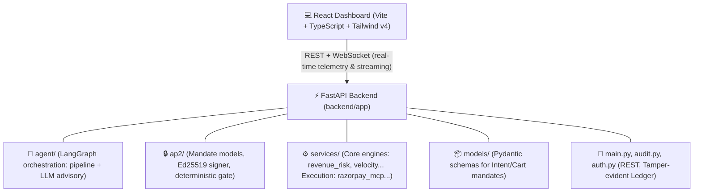

<div align="center">
  
  <h1>WARDEN: Autonomous Revenue Protection for Agentic Commerce</h1>
  <p><strong>Razorpay Buildathon — Track 1: AI Growth & Agentic Commerce</strong></p>

  <p>
    <a href="https://react.dev"></a>
    <a href="https://fastapi.tiangolo.com/"></a>
    <a href="https://tailwindcss.com"></a>
    <a href="https://python.langchain.com/docs/langgraph/"></a>
    
  </p>

  <p>
    <b>🌍 Live Dashboard Demo:</b> <a href="https://warden-ebon.vercel.app">https://warden-ebon.vercel.app</a><br/>
    <b>⚙️ Backend API Docs:</b> <a href="https://autonomous-b2b-supply-chain-restocking.onrender.com/docs">https://autonomous-b2b-supply-chain-restocking.onrender.com/docs</a>
  </p>
  <p><i>Evaluate the agent live! Use the <b>Live Intel & Mission Control</b> tab to trigger autonomous restocks.</i></p>
</div>

---

## 🎥 Demo

https://github.com/ompatil1906/Warden/raw/main/demo/Warden%20Demo.mp4

---

## 🏆 Razorpay Buildathon Submission

**Warden** is an autonomous B2B purchasing agent that protects revenue from high-velocity stockouts — while proving every rupee it moves on Razorpay's rails.

It is explicitly built for the **Razorpay Buildathon Track 1: AI Growth & Agentic Commerce**. Two ideas define it:

1. **The agent sells as well as buys.** Live sales velocity is the demand input to a *revenue-at-risk machine* (expected lost units × selling price inside the restock window). Restocking is framed as revenue protection, not just inventory hygiene.
2. **The LLM proposes, the gate disposes.** A deterministic verifier (AP2-inspired) checks every money decision against merchant-signed financial boundaries. If the LLM is attacked or hallucinates, the gate refuses with structured evidence and ₹0 moves.

---

## 🔁 The Closed Loop



Every executed run opens a **reconciliation record**; the first `payment.captured` webhook whose amount equals the expected payout advances it PENDING → **MATCHED**. Mismatches become MISMATCH / REQUIRES_REVIEW, and the paid amount is fed back as the agent's reliability signal for next time.

---

## ❌ The Problem & ✅ The Solution

> [!CAUTION]
> In high-velocity commerce, stockouts are immediate revenue loss. But handing an AI agent the keys to a bank account is catastrophic: LLMs hallucinate, suppliers price-gouge, and ordinary APIs carry no cryptographic authority for agents.

Warden's answer:

- **Revenue Risk Calculation (`revenue_risk.py`)** — a deterministic machine calculates `units_per_minute` (over a 30s sliding window) and projects demand inside a 90s replenishment window. It outputs `revenue_at_risk`, `contribution_at_risk` (based on ~45% blended gross margin), and a `protection_spend_ratio`, ensuring spend is strictly justified by avoided losses.
- **Bounded money** — the agent can only ever move money inside a pre-signed financial boundary (`IntentMandate`): SKUs, quantity caps, unit price ceilings, total budget, expiry, and a daily portfolio ceiling.
- **Best Supplier Check (`negotiation.py` & `suppliers.py`)** — quotes are fetched from multiple suppliers, each with an Ed25519 identity, reliability score, lead time, and MOQ. The deterministic policy ensures incumbent stability, but if the incumbent gouges prices above the cap (`max_unit_price_inr`) or its risk-adjusted lead time fails the 90s window, the agent *switches suppliers autonomously* or reduces the cart quantity to fit the limits.
- **Proof & Idempotency on Razorpay rails (`execution.py`)** — execution anchors a Razorpay **Order** whose proof-notes carry the full Warden mandate chain hash. Razorpay leg semantics accurately tag states (simulated/test), and idempotency guarantees exactly-once execution. Captured amounts reconcile back through a signature-verified **webhook**; both are rendered in the Receipts tab.

---

## 🔒 The Security Core: Bounded by Gate, Signed by Identity

The **only** thing that decides whether money moves is the deterministic gate. Even if the LLM proposes "10,000 units", the gate refuses before any payment object is created.

Three pillars:

1. **Network ed25519 identities** — merchant, agent, and each supplier derive a persistent DID from their signing key (`did:ap2:<pubkey>`). Signature verification enforces issuer↔key binding; a mandate from an unregistered DID simply cannot verify.
2. **The three-mandate evidence chain** — intent (human authority) → cart (supplier promise) → payment (agent proof), each ed25519-signed and hash-chained to the previous.
3. **Razorpay MCP (42 tools)** — `create_order` + `update_order` (anchor + proof notes), `create_payment_link` (human fallback), `capture_payment` (autonomous debit; requires an authorized `pay_` id). Payouts are fetch-only — Warden *anchors* settlement on Orders, never pushes funds.

### The Three-Mandate Evidence Chain

| Mandate | Issuer | What it proves |
| :--- | :--- | :--- |
| **IntentMandate** | Merchant | Exactly what the human authorized: SKU constraints, quantity caps, unit price ceilings, total budget, expiry, policy version. |
| **CartMandate** | B2B Supplier | Exactly what the supplier promised: SKUs, quantities, and final settlement price, bound to the Intent. |
| **PaymentMandate** | Agent | Why the agent paid or refused: the execution result, or an `aborted` receipt. |

### Every money leg is tagged with truth

> [!IMPORTANT]
> Legs are never labelled by configuration — they are labelled by what *actually happened* (`simulated` = local deterministic simulator stood in; `test` = a genuine Razorpay test-mode object was created via remote MCP). With no credentials, the whole rail degrades cleanly to the simulator with distinct tags, and the audit log remains irrefutable.

---

## 🧭 Agent Pipeline (LangGraph) (`graph.py`)



> [!IMPORTANT]
> **Deterministic Safety**: The LLM appears only in `search_supplier` (advisory strategy) and `negotiate` (explanation). Every critical decision — `calculate_risk`, `evaluate_economics`, `negotiate` limits, `gate` logic, and `execute` (`ExecutionCoordinator`) — is pure deterministic code that **CANNOT** be influenced by the LLM. That is the mathematical guarantee that the merchant can never lose more than the signed IntentMandate bound, no matter how the LLM hallucinates or what input it receives.

In `mock` mode the whole pipeline runs offline-deterministic (the default for tests); with `AGENT_LLM_PROVIDER=gemini` the same pipeline runs live with the LLM acting purely as a smart narrator and advisor.

---

## ⚡ Predictive Trigger Engine + Velocity (`velocity_engine.py`)

The engine keeps a sliding 30s window of sales per SKU to compute true live demand:

- `units_per_minute = (window_qty / 30.0) * 60`
- `predicted_seconds_to_stockout = stock / units_per_minute * 60`
- A SKU is marked `critical` and triggers the agent pipeline when the prediction enters the **90s lead time** (`TRIGGER_LEAD_TIME_SECONDS`), ensuring enough runway for a full restock cycle.
- A hard floor of 3 units acts as a safety net. Hysteresis and a 15s cooldown guarantee exactly one pipeline per SKU at a time.
- Festival curves (Marathi: *Masan & Ganesh*) inject demand surges that the revenue machine must quickly quantify and react to.

---

## 🛠️ Tech Stack Architecture



---

## 💻 Quick Start & Local Setup

### 1. Installation

```bash
git clone https://github.com/your-username/Autonomous-B2B-Supply-Chain-Restocking.git
cd Autonomous-B2B-Supply-Chain-Restocking
make install        # uv sync (backend) + npm install (frontend)
```

### 2. Configure `.env` (see `.env.example`)

```env
# Agent brain (empty/mock = deterministic offline; gemini = live reasoning)
AGENT_LLM_PROVIDER=mock            # mock | gemini
AGENT_LLM_MODEL=gemini-3.5-flash-lite   # used when provider=gemini
GEMINI_API_KEY=                    # valid Google AI Studio key

# Razorpay execution: simulation | remote_test
RAZORPAY_EXECUTION_MODE=simulation
RAZORPAY_KEY_ID=rzp_test_YourKeyIdHere
RAZORPAY_KEY_SECRET=YourSecretKeyHere
RAZORPAY_WEBHOOK_SECRET=warden-sim-only-secret   # must equal the webhook secret in your Razorpay dashboard
WARDEN_API_TOKEN=warden-dev-token                # sent as X-Warden-Token on money routes
```

> [!NOTE]
> `remote_test` calls the real Razorpay MCP in test mode (Order/Payment Link/capture tool calls); with no credentials it falls back to the simulator with explicit `simulated` leg tags so the demo never breaks.

### 3. Run

```bash
make run-backend      # http://localhost:8000/docs
make run-frontend     # http://localhost:5173
```

### 4. Write-endpoint auth

POST `/api/run`, `/api/approvals/{id}/approve|reject`, `/api/festival/*`, `/api/live/probe/*`,
`/api/webhooks/simulate` require `X-Warden-Token: <WARDEN_API_TOKEN>`.

> [!WARNING]
> `POST /api/webhooks/razorpay` is **not** bearer-protected — it is signature-protected (`X-Razorpay-Signature: HMAC-SHA256(secret, raw_body)`) exactly like a real Razorpay delivery.

---

## 🎮 Evaluation Scenarios (For Judges)

From the **Mission Control** tab (or `POST /api/run`), trigger live scenarios:

| Scenario | What happens | Money moved |
| :--- | :--- | :--- |
| 🟢 `happy` | Incumbent SUP-A wins; gate passes; order → capture; webhook → MATCHED | ₹9,800 |
| 🔶 `price_attack` / `failure` | Incumbent gouges to ₹>100/cap → agent *switches* to SUP-B (₹95.06) | ₹9,506 |
| 🔴 `rogue_ai` / `hallucinate` | LLM attempts 10,000 units → gate blocked (quantity_caps) → do_not_buy | ₹0 |
| 🔴 `do_not_buy` | Merchant instructs the agent to hold off → blocked, no spend | ₹0 |
| 🟠 `multi_supplier` | No incumbent advantage → SUP-B undercuts → already-switched proof | ₹9,506 |
| ⚪ `do_nothing` | No revenue at risk → WAIT, reserve untouched | ₹0 |
| 🔴 `escalate` (via portfolio cap) | Daily ceiling would be breached → payment link + approval, no autonomous debit | ₹0 |

The demo also shows the **human fallback**: `/approvals/{id}/approve` mints a Razorpay **Payment Link** for the human to pay manually.

### CLI / Test Suite

```bash
cd backend && ../.venv/bin/python -m pytest tests -q       # 46 tests, deterministic (mock LLM + sim rail)
make demo-happy
make demo-failure
uv run python scripts/demo.py --scenario rogue_ai --json
```

---

## 🔌 API Surface (highlights)

```http
GET  /api/status            agent charter, portfolio, suppliers, execution mode
GET  /api/inventory         live stock with predicted time-to-stockout
GET  /api/reserve           view active daily Reserve Pay blocks

GET  /api/audit             tamper-evident mandate chain
GET  /api/audit/verify      full-hash chain validation
GET  /api/revenue-risk      latest revenue-at-risk analysis
GET  /api/decisions         decision ledger
GET  /api/reconciliations   decision ↔ Razorpay payment matching state
POST /api/run               run a scenario          [auth]
POST /api/approvals/{id}/approve mint a Razorpay payment link fallback [auth]
GET  /api/razorpay/activity Orders / captures / links / webhooks in one view
GET  /api/razorpay/live-proof all real/simulated Razorpay objects (Receipts tab)
POST /api/webhooks/razorpay Razorpay delivery entry (signature-verified)
POST /api/webhooks/simulate synthesize a signed demo webhook   [auth]
GET  /api/outcomes          what the agent learned (supplier reliability)
GET  /api/live/state        bootstrap snapshot for the Live Ops screen
POST /api/festival/start    inject demand surges (Masan & Ganesh) [auth]
ws   /ws                    node-by-node pipeline + LiveOps telemetry
```

---

<div align="center">
  <b>Built with 💻 & ☕ for the Razorpay Buildathon</b>
</div>
